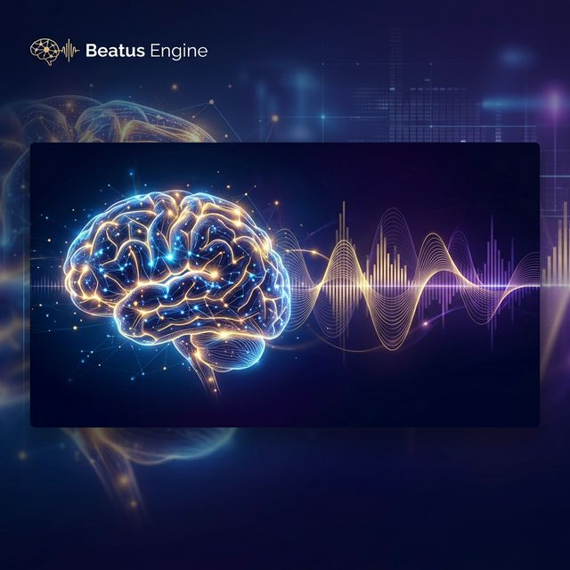
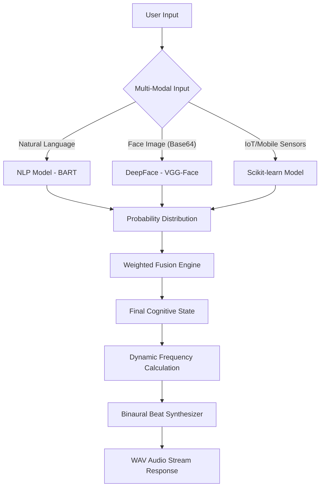

# 🧠 Beatus Engine: AI Cognitive State API



> **"Turning human emotions into adaptive brainwave experiences."**

Beatus Engine is a sophisticated, multi-modal AI API designed to detect a user's **cognitive state** (Focused, Relaxed, or Stressed) through text sentiment, facial expressions, and physiological sensor data. It then algorithmically generates personalized **binaural beats** (WAV) in real-time to help users reach their desired mental state.

---

## 🌐 Live API & Documentation
- **API Endpoint:** `https://shyamkano-ai-cognitive-api.hf.space/`
- **Swagger Docs:** `https://shyamkano-ai-cognitive-api.hf.space/apidocs/`

---

## ✨ Core Features
- **Multi-Modal Fusion:** Combines NLP (Text), Computer Vision (Face), and ML (Sensors) for high-accuracy state detection.
- **Real-Time Audio Synthesis:** Dynamically calculates frequencies based on confidence scores to generate custom `.wav` binaural beats.
- **Secure & Scalable:** Built-in API Key authentication and rate-limiting (5 requests/min).
- **Interactive Documentation:** Integrated Swagger UI for testing endpoints directly.

---

## ⚙️ How It Works (System Architecture)



---

## 🛠️ Tech Stack
| Component | Technology |
| :--- | :--- |
| **Backend Framework** | Flask (Python) |
| **NLP Engine** | HuggingFace Transformers (facebook/bart-large-mnli) |
| **Facial Recognition** | DeepFace (VGG-Face) & OpenCV |
| **Sensor ML** | Scikit-learn (RandomForest/XGBoost) |
| **Audio Processing** | NumPy & SoundFile |
| **API Docs** | Flasgger (Swagger UI) |
| **Server** | Gunicorn |

---

## 🚀 Getting Started

### Prerequisites
- Python 3.9+
- [FFmpeg](https://ffmpeg.org/) (for audio processing support)

### Local Installation
1. **Clone the repository:**
   ```bash
   git clone https://github.com/shyamkano/ai-cognitive-api.git
   cd ai-cognitive-api
   ```

2. **Setup virtual environment:**
   ```bash
   python -m venv venv
   source venv/bin/activate  # On Windows: venv\Scripts\activate
   ```

3. **Install dependencies:**
   ```bash
   pip install -r requirements.txt
   ```

4. **Run the server:**
   ```bash
   python app.py
   ```
   The API will be available at `http://localhost:5000`.

---

## 📡 API Documentation

### `POST /recommend`
Analyze inputs and generate a custom binaural beat.

**Headers:**
| Key | Value | Description |
| :--- | :--- | :--- |
| `Content-Type` | `application/json` | |
| `X-API-Key` | `dev-key-for-your-app-123` | Required for authorization |

**Request Body (JSON):**
```json
{
  "text_input": "I am feeling quite stressed with work lately",
  "face_image_base64": "data:image/jpeg;base64,...",
  "sensor_input": {
    "heart_rate": 85,
    "skin_temp": 36.5,
    "steps": 1000,
    "activity_level": 2,
    "ambient_noise": 40,
    "hour_of_day": 14
  }
}
```
*Note: You can provide any combination of the three inputs. The engine will weight available data.*

**Response:**
- **Status:** `200 OK`
- **Type:** `audio/wav`
- **Custom Headers:**
  - `X-Predicted-State`: `Stressed | Relaxed | Focused`
  - `X-Confidence`: Probability score (0.0 - 1.0)
  - `X-Beat-Frequency`: The generated beat frequency (Hz)

---

## 🧪 Usage Examples

### JavaScript (Fetch API)
```javascript
async function generateBeats() {
  const response = await fetch("YOUR_API_URL/recommend", {
    method: "POST",
    headers: {
      "Content-Type": "application/json",
      "X-API-Key": "dev-key-for-your-app-123"
    },
    body: JSON.stringify({ text_input: "Focusing on my code" })
  });

  const blob = await response.blob();
  const audio = new Audio(URL.createObjectURL(blob));
  audio.play();
}
```

### Python (Requests)
```python
import requests

url = "https://shyamkano-ai-cognitive-api.hf.space/recommend"
headers = {"X-API-Key": "dev-key-for-your-app-123"}
payload = {"text_input": "I feel very relaxed"}

response = requests.post(url, json=payload, headers=headers)

if response.status_code == 200:
    with open("beat.wav", "wb") as f:
        f.write(response.content)
    print(f"Predicted State: {response.headers.get('X-Predicted-State')}")
```

---

## 👨‍💻 Developer
**Ghanshyam Kanojiya**
- AI + Full Stack Developer
- Specializing in Cognitive AI & IoT
- [GitHub](https://github.com/shyamkano) | [Portfolio](https://shyamkano.github.io)

---

## ⭐ Support
If you find this project useful, please consider giving it a star! 🌟
Also, check out the mobile companion app [Groovli](https://github.com/shyamkano/groovli) which integrates this API.
